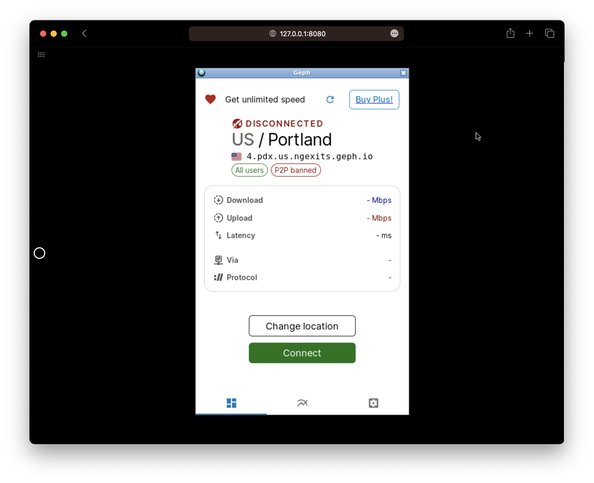

---


## Description

This image enables you to run GephGui (迷雾通) in a docker container. You can use the proxy at port 9909 (Socks5 Proxy) and port 9910(HTTP Proxy).

## Usage

Here's some instrction on how to run the container.

```bash
docker run -d \
  -p 9909:9909 \
  -p 9910:9910 \
  -p 8080:8080 \
  -v /path/to/config:/config \
  -e PUID=1000 \
  -e PGID=1000 \
  -e TZ=Asia/Shanghai \
  -e PASSWORD=`#optional` \
  --name gephgui \
  --restart unless-stopped \
  justinhimself/gephgui
```

You will only need to modify the volume binding (`-v`), and not worry about the rest.

After the container is up and running, you will need to manully change some settings in order for GephGui to function.

1. Open your browser and enter address `http://127.0.0.1:8080`. The address and port depends on your setup.

2. Click on "settings", turn on "Listen on all interfaces" (监听所有地址)

3. Go back to main menu, click "Connect"

After that, you can use the proxy at port `9909` and `9910`.

## Parameters

Container images are configured using parameters passed at runtime (such as those above). These parameters are separated by a colon and indicate <external>:<internal> respectively. For example, -p 8080:80 would expose port 80 from inside the container to be accessible from the host's IP on port 8080 outside the container.

| Parameters            | Function                                      |
| --------------------- | --------------------------------------------- |
| `-p 9909`             | Socks5 Proxy                                  |
| `-p 9910`             | HTTP Proxy                                    |
| `-p 8080`             | GephGui interface                             |
| `-v config`           | Where GephGui stores the user data and config |
| `-e PUID=1000`        | for UserID - see below for explanation        |
| `-e PGID=1000`        | for GroupID - see below for explanation       |
| `-e TZ=Asia/Shanghai` | Specify a timezone to use Asia/Shanghai       |
| `-e PASSWORD=`        | Optionally set a password for the web gui.    |

## PUID and PGID

When using volumes (`-v` flags) permissions issues can arise between the host OS and the container, we avoid this issue by allowing you to specify the user `PUID` and group `PGID`.

Ensure any volume directories on the host are owned by the same user you specify and any permissions issues will vanish like magic.

In this instance `PUID=1000` and `PGID=1000`, to find yours use id user as below:

```bash
  $ id username
    uid=1000(dockeruser) gid=1000(dockergroup) groups=1000(dockergroup)
```

## Build locally

The Dockerfile is publically availiable at [justin-himself/docker-autobuild](https://github.com/justin-himself/docker-autobuild). Execute the followling command if you want to build a custom version of the image.

```bash
git clone https://github.com/justin-himself/docker-autobuild.git
cd docker-autobuild/gephgui
docker build \
  --no-cache \
  --pull \
  -t justin-himself/gephgui:latest .
```

## Screenshots



## Reference

- [gephgui-wry](https://github.com/geph-official/gephgui-wry)
- [geph4-client](https://github.com/geph-official/geph4-client)
- [baseimage-rdesktop-web](https://github.com/linuxserver/docker-baseimage-rdesktop-web)
